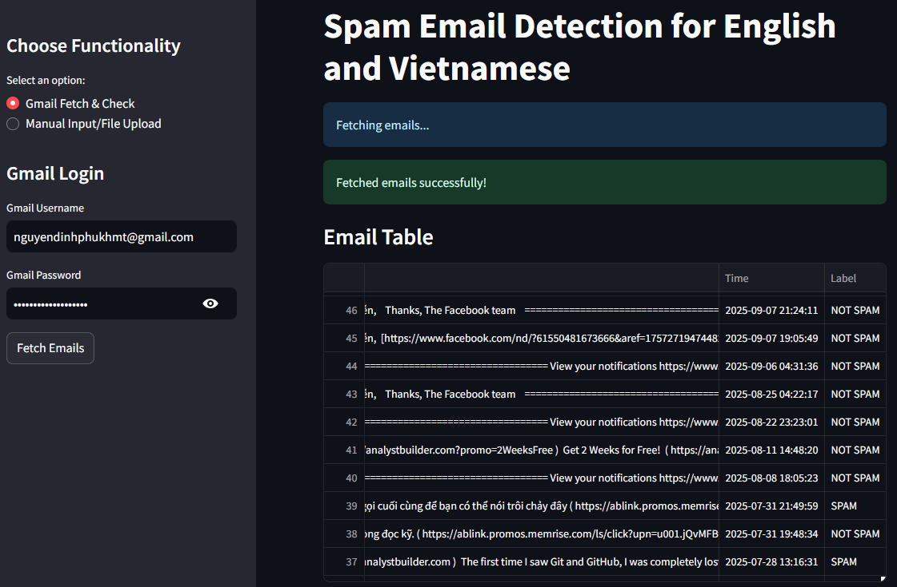
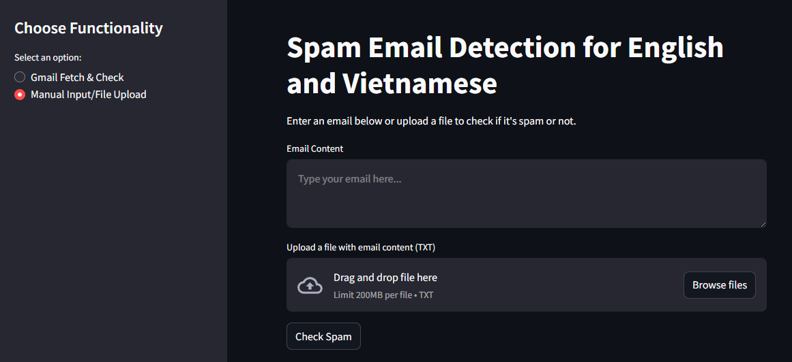

# 📧 Email Spam Detection System

A comprehensive machine learning project for detecting spam emails using multiple classification algorithms with both English and Vietnamese language support.



## 🎯 Project Overview

This project implements an intelligent email spam detection system that can classify emails as spam or ham (legitimate) using various machine learning algorithms. The system supports both English and Vietnamese languages through automatic translation capabilities.

## ✨ Features

- **Multi-language Support**: Automatic translation from English to Vietnamese
- **Multiple ML Algorithms**: 
  - Naive Bayes (Multinomial & Gaussian)
  - Logistic Regression
  - Support Vector Machine (SVM)
  - Random Forest
  - Gradient Boosting
- **Interactive Web Interface**: Built with Streamlit
- **Data Preprocessing**: Advanced text cleaning and feature extraction
- **Model Comparison**: Performance metrics and visualization
- **Real-time Prediction**: Live email classification

## 🛠️ Technologies Used

- **Python 3.x**
- **Machine Learning**: scikit-learn
- **Data Processing**: pandas, numpy
- **Visualization**: matplotlib, seaborn
- **Web Framework**: Streamlit
- **Translation**: googletrans
- **Text Processing**: TF-IDF Vectorization

## 📋 Requirements

```txt
streamlit
pandas
scikit-learn
matplotlib
seaborn
googletrans==4.0.0rc1
joblib
numpy
```

## 🚀 Installation

1. **Clone the repository**
```bash
git clone https://github.com/phunguyendinh/ml_emailspam_classification.git
cd ml_emailspam_classification
```

2. **Run the application**
```bash
streamlit run application_fusion.py
```

## 📊 Dataset

The project uses email datasets with the following structure:
- **emails2.csv**: Preprocessed email features (3002 columns)
- **translated_emails_vietnamese.csv**: Vietnamese translated emails
- Features include word frequencies and email metadata
- Binary classification: 0 (Ham) / 1 (Spam)

## 🔧 Project Structure

```
email-spam-detection/
│
├── application_fusion.py      # Streamlit web application
├── email2.ipynb             # Data analysis notebook (English dataset)
├── email3.ipynb             # Translation and Vietnamese analysis
├── DATA/
│   ├── emails2.csv           # Main dataset
│   └── translated_emails_vietnamese.csv
├── models/                   # Saved ML models
├── requirements.txt          # Project dependencies
└── README.md                # Project documentation
```

## 🧠 Machine Learning Pipeline

### 1. Data Preprocessing
- Text cleaning and normalization
- Feature extraction using TF-IDF
- Data splitting (train/test)

### 2. Model Training
```python
# Multiple algorithms comparison
models = {
    'Naive Bayes': MultinomialNB(),
    'Logistic Regression': LogisticRegression(),
    'SVM': SVC(),
    'Random Forest': RandomForestClassifier(),
    'Gradient Boosting': GradientBoostingClassifier()
}
```

### 3. Model Evaluation
- Accuracy scores
- Classification reports
- Confusion matrices
- Cross-validation

## 📈 Performance Metrics

| Algorithm | Accuracy | Precision | Recall | F1-Score |
|-----------|----------|-----------|--------|----------|
| Naive Bayes | 95% | 95% | 95% | 95% |
| Logistic Regression | 97% | 97% | 97% | 97% |
| SVM | 95% | 95% | 95% | 95% |
| Random Forest | 95% | 97% | 97% | 97% |
| Gradient Boosting | 95% | 95% | 95% | 95% |

## 🌐 Web Application Features

### Main Interface
- **Email Input**: Text area for email content
- **Language Selection**: English/Vietnamese support
- **Model Selection**: Choose from multiple algorithms
- **Real-time Prediction**: Instant spam/ham classification
- **Confidence Score**: Prediction probability

### Analytics Dashboard
- **Dataset Overview**: Statistics and visualizations
- **Model Comparison**: Performance metrics
- **Word Cloud**: Most common spam/ham words
- **Distribution Charts**: Data balance visualization

## 🔍 Usage Examples

### Command Line Prediction
```python
# Load trained model
model = joblib.load('models/best_model.pkl')
vectorizer = joblib.load('models/vectorizer.pkl')

# Predict new email
email_text = "Your email content here..."
prediction = model.predict(vectorizer.transform([email_text]))
```

### Web Interface
1. Open the Streamlit application
2. Enter email content in the text area
3. Select desired model
4. Click "Predict" for classification result

## 🌍 Translation Feature

The system includes automatic translation capabilities:

```python
def translate_dataset(file_path, output_path, text_column, src_lang='en', dest_lang='vi'):
    translator = Translator()
    # Translation logic here
```

## 📝 Model Persistence

Trained models are saved using joblib:
```python
# Save model
joblib.dump(model, 'models/spam_detector.pkl')
joblib.dump(vectorizer, 'models/tfidf_vectorizer.pkl')

# Load model
model = joblib.load('models/spam_detector.pkl')
```

## 👨‍💻 Author

**Your Name**
- GitHub: [@phunguyendinh](https://github.com/phunguyendinh)
- Email: nguyendinhphu200@gmail.com

## 🐛 Known Issues

- Translation API rate limits may affect large datasets
- Some special characters might not be handled properly
- Model performance may vary with different email formats

⭐ **If you found this project helpful, please give it a star!** ⭐